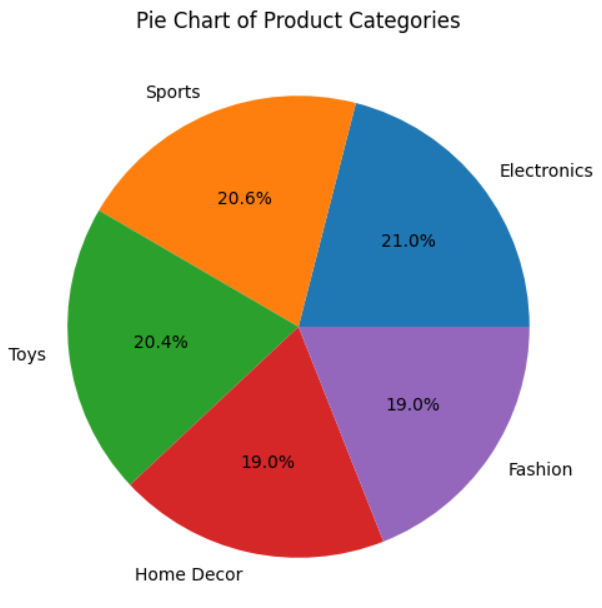
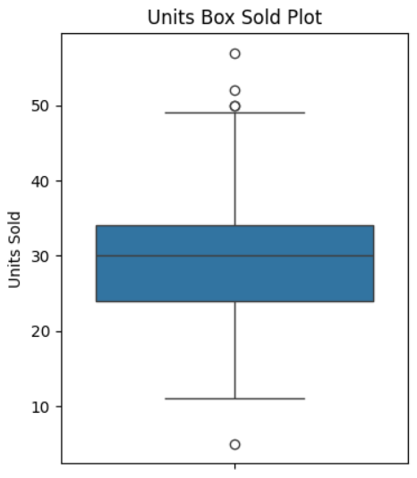
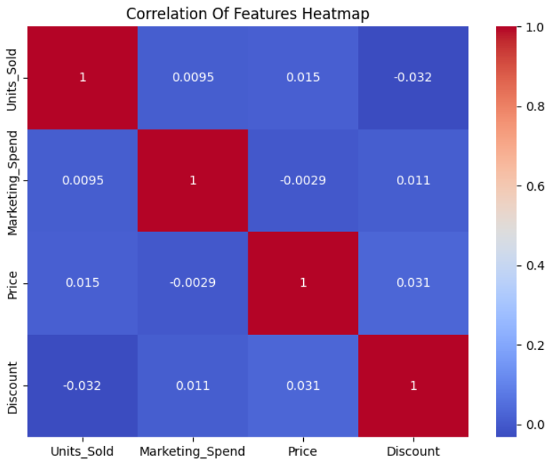
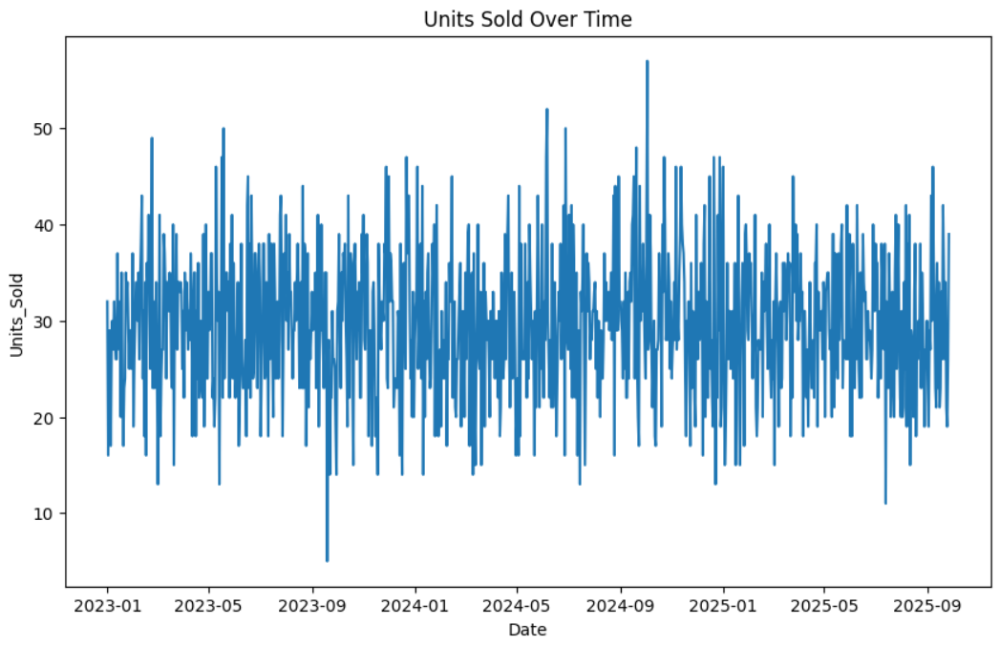
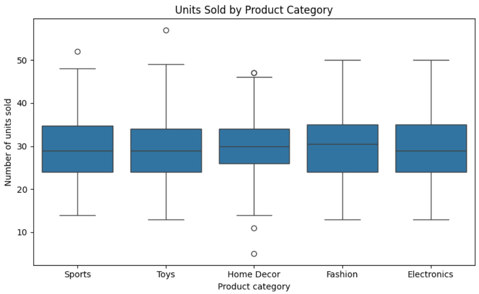
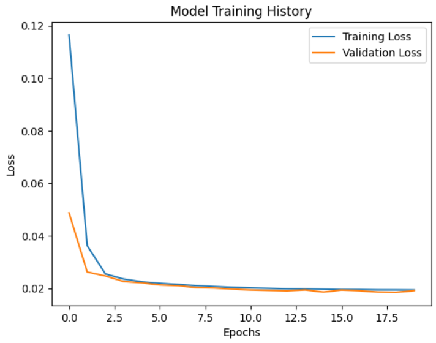

# Ecommerce Sales Analytics and Optimization

This project presents an end-to-end ecommerce sales analytics workflow using Python. It covers descriptive analytics, predictive analytics, and prescriptive analytics to understand sales behavior, compare forecasting models, and support business decision-making.

The project is divided into three main notebooks:

1. Descriptive Analytics
2. Predictive Analytics
3. Prescriptive Analytics

Each notebook focuses on a different stage of the analytics process, starting from understanding the data, then building predictive models, and finally applying optimization logic to support better decisions.

---

## Project Objective

The main objective of this project is to analyze ecommerce sales data and convert raw data into useful business insights and decisions.

The project answers questions such as:

* What are the main patterns in ecommerce sales?
* How are product categories distributed?
* How are units sold distributed?
* Is there a strong relationship between price, discount, marketing spend, and units sold?
* Which predictive model performs better for estimating units sold?
* How can optimization techniques support better business decisions?

---

## Dataset

The project uses an ecommerce sales dataset containing product, customer, pricing, marketing, and sales information.

Main columns include:

* `Product_Category`
* `Customer_Segment`
* `Price`
* `Discount`
* `Marketing_Spend`
* `Units_Sold`
* `Date`

The main target variable used in the predictive analytics part is:

* `Units_Sold`

---

## Repository Files

```text
ecommerce-sales-analytics-optimization/
│
├── README.md
├── requirements.txt
├── .gitignore
├── ecommerce_sales_dataset.csv
│
├── descriptive_analytics.ipynb
├── predictive_analytics.ipynb
├── prescriptive_analytics.ipynb
│
└── visualizations/
    ├── category_distribution.png
    ├── units_box_sold_plot.png
    ├── correlation_heatmap.png
    ├── sales_over_time.png
    ├── units_sold_by_category.png
    └── model_training_validation_loss_over_epochs.png
```

---

# 1. Descriptive Analytics

## File

`descriptive_analytics.ipynb`

## What was done

This notebook focuses on understanding the ecommerce sales dataset using descriptive analytics techniques.

The main work included:

* Loading and inspecting the dataset.
* Exploring numerical and categorical columns.
* Calculating descriptive statistics such as mean, median, and quartiles.
* Analyzing product category distribution.
* Analyzing units sold distribution.
* Studying units sold over time.
* Comparing units sold across product categories.
* Checking correlations between numerical variables.
* Extracting business insights from the visualizations.

## Main findings

The descriptive analysis showed that the average product price was around `505`, the average discount was around `25%`, and the average marketing spend was around `4913`.

The product categories were almost evenly distributed. Electronics represented `21.0%`, Sports represented `20.6%`, Toys represented `20.4%`, while Fashion and Home Decor each represented `19.0%`. This means that no single product category dominated the dataset.

The units sold distribution showed that most values were centered around approximately `30` units, with some outliers at both the low and high ends. This suggests that most products sell within a relatively stable range, but some products perform unusually low or unusually high.

The correlation heatmap showed very weak relationships between the numerical variables. For example, the correlation between `Units_Sold` and `Discount` was approximately `-0.032`, which is very weak. This means there was no strong direct linear relationship between sales and variables such as price, discount, or marketing spend.

The units sold over time plot showed noticeable fluctuations, but no clear long-term upward or downward trend. This suggests that sales may be affected by temporary factors rather than a stable time-based trend.

## Business interpretation

The descriptive analytics results suggest that the company should not focus only on one product category because the categories are relatively balanced. The weak correlation between marketing spend and units sold also suggests that marketing campaigns should be reviewed, because spending more does not appear to directly increase sales in a clear linear way.

---

## Descriptive Analytics Visualizations

### Product Category Distribution

This pie chart shows that product categories are distributed almost evenly. Electronics has the highest share at `21.0%`, but the difference between categories is small.



### Units Sold Distribution

This box plot shows the distribution of units sold. The median is around `30` units, with a few outliers at the lower and upper ends.



### Correlation Heatmap

This heatmap shows the correlation between numerical variables such as `Units_Sold`, `Marketing_Spend`, `Price`, and `Discount`. The relationships are very weak, meaning that these variables do not have strong direct linear relationships.



### Units Sold Over Time

This line chart shows that units sold fluctuate over time without a clear long-term increasing or decreasing trend.



### Units Sold by Product Category

This box plot compares units sold across product categories. The medians and spreads are relatively similar, which supports the finding that no category has a clearly distinct sales pattern.



---

# 2. Predictive Analytics

## File

`predictive_analytics.ipynb`

## What was done

This notebook focuses on predictive analytics for estimating or forecasting the number of units sold.

The main work included:

* Preparing the dataset for machine learning.
* Selecting `Units_Sold` as the target variable.
* Applying feature selection techniques.
* Building different predictive models.
* Comparing model performance using regression metrics.
* Interpreting the model results to decide which model was more useful.

## Feature selection techniques used

Two feature selection techniques were used:

* `SelectKBest`
* `Sequential Feature Selector`

`SelectKBest` selected the top features based on their statistical relationship with the target variable. Sequential Feature Selector used forward selection to choose features that improved model performance.

## Models used

The predictive analytics notebook compared the following models:

* Moving Average
* Linear Regression with SelectKBest
* Linear Regression with Sequential Feature Selector
* LSTM

## Evaluation metrics

The models were evaluated using:

* MAE
* MSE
* RMSE
* R² Score

## Main findings

The Moving Average model gave the most balanced overall performance. It had an MAE of around `4.7341`, MSE of around `35.6357`, RMSE of around `5.9695`, and R² of around `0.3236`.

The Linear Regression models performed poorly. Linear Regression with SelectKBest and Linear Regression with Sequential Feature Selector both produced weak results, which suggests that the relationship between the selected input variables and `Units_Sold` was not strongly linear.

The LSTM model produced low loss values during training, and the training and validation loss decreased quickly before stabilizing. However, the model still needs to be judged using evaluation metrics such as R², not only training loss. A low loss curve does not always mean the model is reliable for final prediction.

## Business interpretation

The predictive analytics part shows that complex models are not always better. In this project, the Moving Average model was more balanced, while Linear Regression struggled because the dataset did not contain strong linear relationships between the available features and units sold.

This suggests that better prediction may require additional business features, more advanced feature engineering, or more meaningful time-based features.

---

## Predictive Analytics Visualizations

### LSTM Training History

This plot shows the training and validation loss of the LSTM model across epochs. Both curves decreased quickly and then stabilized, which indicates that the model learned rapidly during training.



---

# 3. Prescriptive Analytics

## File

`prescriptive_analytics.ipynb`

## What was done

This notebook focuses on prescriptive analytics and optimization.

The main work included:

* Applying optimization logic to support decision-making.
* Using a Genetic Algorithm to search for better solutions.
* Defining a fitness function based on MAE.
* Evaluating individuals based on their fitness values.
* Preserving the best individuals using elitism.
* Selecting individuals based on fitness.
* Applying crossover to combine candidate solutions.
* Applying mutation to avoid premature convergence.
* Replacing the old population with a new population.
* Extracting the best solution from the optimization process.

## Genetic Algorithm logic

The Genetic Algorithm used the following steps:

1. Fitness evaluation
2. Elitism
3. Selection
4. Crossover
5. Mutation
6. Population replacement
7. Best solution extraction

The fitness function was based on MAE, where a lower MAE means a better solution.

## Main findings

The Genetic Algorithm was used to search for optimal weights. Elitism helped preserve the best individuals between generations, while crossover and mutation helped generate new candidate solutions.

The algorithm demonstrated how optimization can support decision-making beyond descriptive and predictive analytics. Instead of only describing what happened or predicting what may happen, prescriptive analytics focuses on finding better actions or decisions based on an objective function.

## Business interpretation

The prescriptive analytics part shows how optimization can support business decisions. By defining a goal such as minimizing error, the optimization process can search for better solutions and help decision-makers choose more effective strategies.

---

## Tools and Libraries

The project used the following tools and libraries:

* Python
* Pandas
* NumPy
* Matplotlib
* Seaborn
* Scikit-learn
* TensorFlow / Keras
* SciPy
* Jupyter Notebook

---

## How to Run

1. Clone the repository:

```bash
git clone https://github.com/OsamaHasan1/ecommerce-sales-analytics-optimization.git
```

2. Move into the project folder:

```bash
cd ecommerce-sales-analytics-optimization
```

3. Install the required libraries:

```bash
pip install -r requirements.txt
```

4. Open the notebooks using Jupyter Notebook or Google Colab.

Recommended order:

```text
1. descriptive_analytics.ipynb
2. predictive_analytics.ipynb
3. prescriptive_analytics.ipynb
```

---

## Conclusion

This project demonstrates the full data analytics process, starting from descriptive analytics, moving to predictive analytics, and ending with prescriptive analytics.

The descriptive analytics part showed that product categories were balanced, units sold were mostly centered around a stable range, and numerical correlations were weak. The predictive analytics part showed that Moving Average was the most balanced model, while Linear Regression struggled because the dataset did not contain strong linear relationships. The prescriptive analytics part demonstrated how a Genetic Algorithm can be used to search for better solutions using fitness evaluation, elitism, selection, crossover, and mutation.

Overall, the project shows how descriptive, predictive, and prescriptive analytics can work together to support business decision-making.
